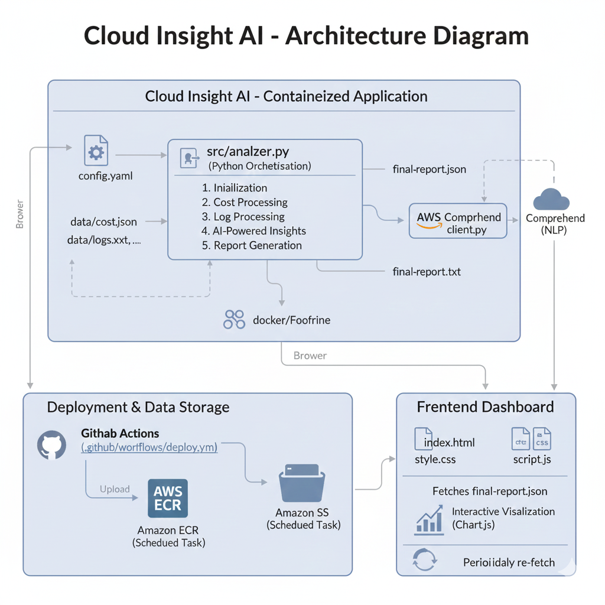

# Cloud Insight AI

Cloud Insight AI is a containerized cloud monitoring and analysis tool that processes cost and log data, generates AI-assisted insights, and visualizes the results on a web dashboard.

---

## How It Works

### 1. Configuration
The application is controlled using a YAML configuration file.  
This file defines:
- cost and log data sources  
- error and cost thresholds  
- feature toggles (AI insights, notifications)  
- output and reporting settings  

### 2. Containerized Execution
The backend runs inside a Docker container.  
GitHub Actions builds the Docker image and pushes it to Amazon ECR.

### 3. Analyzer Orchestration
Inside the container, `analyzer.py` acts as the entry point and coordinates:
- configuration loading  
- cost analysis  
- log processing  
- optional AI-based insights  
- report generation  

### 4. Cost Analysis
Cost data from `data/cost.json` is analyzed to identify trends and anomalies.

### 5. Log Analysis
Application, performance, and security logs are parsed to detect errors, warnings, and recurring issues.

### 6. AI-Powered Insights
AWS Comprehend is used to extract sentiment, key phrases, and entities from analysis summaries.

### 7. Report & Metadata Generation
The analyzer generates:
- `final_report.json` – frontend-ready analysis output  
- `final_report.txt` – human-readable summary  
- `config.json` – JSON representation of the active configuration  

### 8. Storage in S3
Generated JSON artifacts are uploaded to Amazon S3, which acts as a static data source for the dashboard.

### 9. Frontend Visualization
A static dashboard fetches `final_report.json` from S3 and renders interactive visualizations.

---

## Architecture

---

## Project Structure

.
├── README.md
├── _push.sh
├── architechture.png
├── cloud.png
├── config.json
├── config.yaml
├── data
│   ├── cost.json
│   ├── logs.txt
│   ├── performance-logs.txt
│   └── security-logs.txt
├── docker
│   └── Dockerfile
├── final_report.json
├── index.html
├── package-lock.json
├── requirements.txt
├── script.js
├── src
│   ├── analyzer.py
│   ├── comprehend_client.py
│   ├── config_loader.py
│   ├── cost_processor.py
│   ├── json_report_generator.py
│   ├── log_processor.py
│   └── notification_handler.py
└── style.css

---

## Tech Stack

- AWS S3 – Stores analysis reports and configuration artifacts  
- Amazon ECR – Docker image registry  
- Amazon ECS – Executes the containerized analyzer  
- AWS IAM – Permissions for ECS, S3, ECR, and CI/CD  
- AWS Comprehend – Optional NLP-based insight generation  
- GitHub Actions – CI/CD pipeline  
- Docker – Containerization  
- Python – Backend analysis  
- Chart.js – Interactive visualizations  
- Frontend – Static HTML, CSS, JavaScript

## 🎥 YouTube Video

Check out the full walkthrough and demo of **Cloud Insight AI** on YouTube:

▶️ **Watch here:** https://youtu.be/7EAaSQkCl3Q
